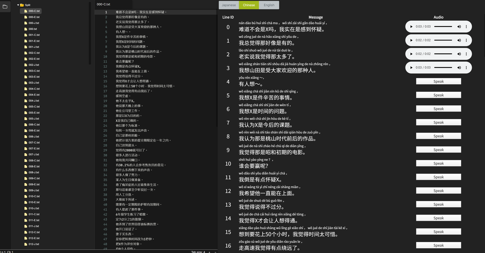

# Simple Multi Language Text To Speech 
- Portable exe
- Command line interface
- GUI with Electron
- Web API with Django



## Sample

<div id="message">
<p><e>Hi, my name is Tomohiro Nagasaka. </e></p><audio controls="" src="/wav/E.ogg" autoplay="">/wav/E.ogg</audio>
<br>
<p><c>你好，我叫长坂友裕。这是我开发的语音合成系统。</c></p><audio controls="" src="/wav/C.ogg" autoplay="">/wav/C.ogg</audio>
<br>
<p>トモです。音声合成エンジンを自作してみました。色々と試してみてください。</p><audio controls="" src="/wav/J.ogg" autoplay="">/wav/J.ogg</audio>
<br>
</div>


## Environment

Tested on Windows 10 and Ubuntu 18 (Currently only released windows exe)

## Usage

TomoSpeakServer/TomoSpeak.exe: Command line interface
TomoSpeakServer/TomoSpeakServer.exe Backend local server for GUI
TomoSpeakGUI.exe: GUI

### Read aloud
```
TomoSpeak.exe C
```
J: Japanese
C: Chinese
E: English

### Output to wav/ogg File
```
TomoSpeak.exe C --input input.txt --output outputfolder --format ogg
```

### Read aloud with GUI
```
RunServer.bat
TomoSpeakGUI.exe
```


## Note

GUI is based on https://github.com/Graviton-Code-Editor/Graviton-App