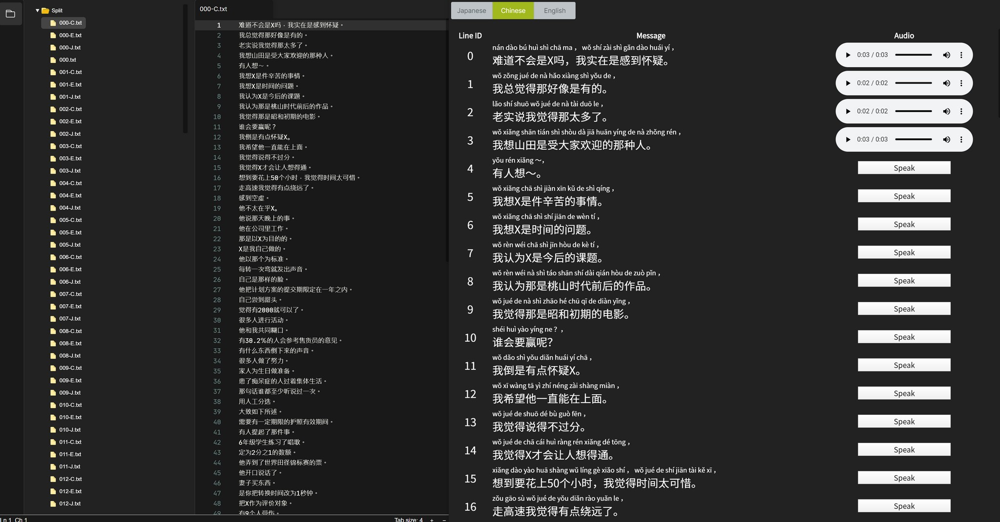

# Simple Multi Language Text To Speech

- Support 日本語/中文/English
- Portable
- GUI
- Web API
- CUI



## Release

Download from [here](release/) (Windows x64 )


## Sample Voice

[https://tomohiro-nagasaka.github.io/Repository/TomoSpeak/](https://tomohiro-nagasaka.github.io/Repository/TomoSpeak/) 


## Environment

Tested on Windows 10 and Ubuntu 18 (Currently only released windows exe)

## Usage

TomoSpeakServer/TomoSpeak.exe: Command line interface
TomoSpeakServer/TomoSpeakServer.exe Backend local server for GUI
TomoSpeakGUI.exe: GUI

### Read aloud
```
TomoSpeak.exe C
```
J: Japanese
C: Chinese
E: English

### Output to wav/ogg File
```
TomoSpeak.exe C --input input.txt --output outputfolder --format ogg
```

### Read aloud with GUI
```
RunServer.bat
TomoSpeakGUI.exe
```


## Note

GUI is based on https://github.com/Graviton-Code-Editor/Graviton-App